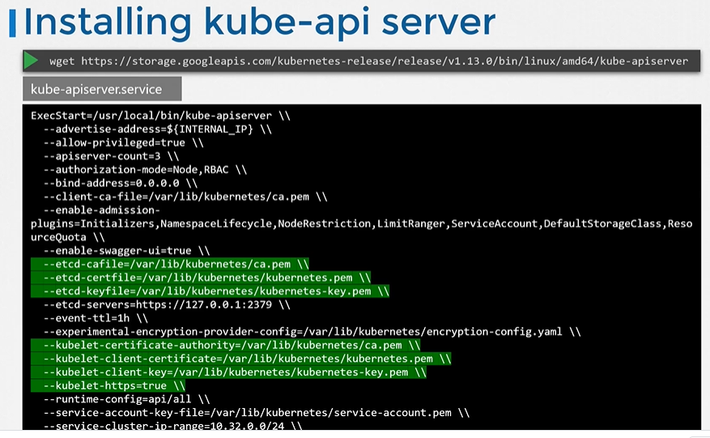

# Kube API Server
  - Take me to [Video Tutorial](https://kodekloud.com/courses/539883/lectures/9808163)
  
In this section, we will talk about kube-apiserver in kubernetes

#### Kube-apiserver is the primary component in kubernetes.
- Kube-apiserver is responsible for **`authenticating`**, **`validating`** requests, **`retrieving`** and **`Updating`** data in ETCD key-value store. In fact kube-apiserver is the only component that interacts directly to the etcd datastore. The other components such as kube-scheduler, kube-controller-manager and kubelet uses the API-Server to update in the cluster in their respective areas.
  
  
  
## Installing kube-apiserver

- If you are bootstrapping kube-apiserver using **`kubeadm`** tool, then you don't need to know this, but if you are setting up using the hardway then kube-apiserver is available as a binary in the kubernetes release page.
  - For example: You can downlaod the kube-apiserver v1.13.0 binary here [kube-apiserver](https://storage.googleapis.com/kubernetes-release/release/v1.13.0/bin/linux/amd64/kube-apiserver)
    ```
    $ wget https://storage.googleapis.com/kubernetes-release/release/v1.13.0/bin/linux/amd64/kube-apiserver
    ```
 
 
 
## View kube-apiserver - Kubeadm
- kubeadm deploys the kube-apiserver as a pod in kube-system namespace on the master node.
  ```
  $ kubectl get pods -n kube-system
  ```
   
  
   
## View kube-apiserver options - Kubeadm
- You can see the options with in the pod definition file located at **`/etc/kubernetes/manifests/kube-apiserver.yaml`**
  ```
  $ cat /etc/kubernetes/manifests/kube-apiserver.yaml
  ```
  
  
   
## View kube-apiserver options - Manual
- In a Non-kubeadm setup, you can inspect the options by viewing the kube-apiserver.service
  ```
  $ cat /etc/systemd/system/kube-apiserver.service
  ```
  
  
   
- You can also see the running process and affective options by listing the process on master node and searching for kube-apiserver.
  ```
  $ ps -aux | grep kube-apiserver
  ```
  

K8s Reference Docs:
- https://kubernetes.io/docs/reference/command-line-tools-reference/kube-apiserver/
- https://kubernetes.io/docs/concepts/overview/components/
- https://kubernetes.io/docs/concepts/overview/kubernetes-api/
- https://kubernetes.io/docs/tasks/access-application-cluster/access-cluster/
- https://kubernetes.io/docs/tasks/administer-cluster/access-cluster-api/
